# The Magic Emporium

**ARPG style loot, brought to Dungeons & Dragons 5e.**

A Foundry VTT module that drops Path of Exile–style randomized magic items into your 5e game and wraps them in a gacha
pull system your players will *actually* get excited about. No more agonizing over hand-picking treasure. No more "you
find a +1 sword" for the hundredth time. Roll it, reveal it, gamble for it.

> **BETA DISCLAIMER**
>
> - Balancing is actively being worked on
> - Internal APIs may change at any time
> - Screen size optimization is a work in progress
> - No automatic updates 

[Live Demo](https://kairosunsupervised.github.io/TheMagicEmporium/iframe.html?id=components-gacha-reveal--default&viewMode=story) - play with the UI in your browser, no install required.

## Features

Every magic item is rolled from a deep pool of modifiers, gated by rarity. Two Rare daggers are never the same daggers.
A Legendary drop is a genuine event. And because the whole thing is automated, the DM doesn't go immediately insane.

- 🎲 **Infinite, distinct loot** Items roll their own properties from a weighted modifier pool. Same base type, wildly
  different results, currently drawing from 166 unique modifiers.
- 🎰 **Gambling** Players spend earned currency in a gacha-like system to *pull* for items, with reveals, picks, and luck
  levers that add excitement and friction
- ⚙️ **Highly automated** Rarity, type, name, modifiers, and effects are all rolled and applied for you. The only things
  left to do are equip, attune, and read!
- 🔧 **2/3 customizable** Modifiers, vouchers, and wishes are all fully customizable. Don't like something? Change it or
  turn it off!
- 🔨 **Sledgehammer balancing** All's fair in love and war. Did you ever want a crit range of 15 to 20? Did you ever want
  bonus charisma specifically for gaslighting your fellow adventurers? Now you can
- 🃏 **Gambling** Did I already tell you about gambling? Check it out below

## The Loot - Items with variety

Items come in five rarities, drawn from every D&D armor and weapon plus 4 sets of clothes and 3 accessories.

  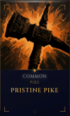
    &nbsp;&nbsp;&nbsp;&nbsp;&nbsp;&nbsp;&nbsp;&nbsp;
  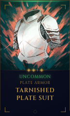
    &nbsp;&nbsp;&nbsp;&nbsp;&nbsp;&nbsp;&nbsp;&nbsp;
  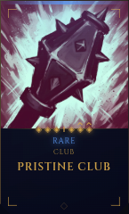
    &nbsp;&nbsp;&nbsp;&nbsp;&nbsp;&nbsp;&nbsp;&nbsp;
  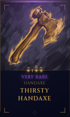
    &nbsp;&nbsp;&nbsp;&nbsp;&nbsp;&nbsp;&nbsp;&nbsp;
  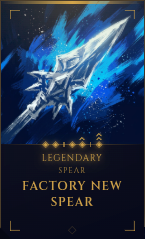

Higher rarity means more modifiers, access to stronger modifier types, and stronger rolls on them. A high-rarity item
should never feel "boring" like a flat stat increase.

  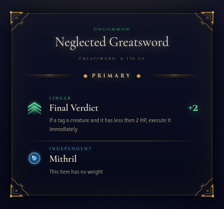
 &nbsp;&nbsp;&nbsp;&nbsp;&nbsp;&nbsp;&nbsp;
  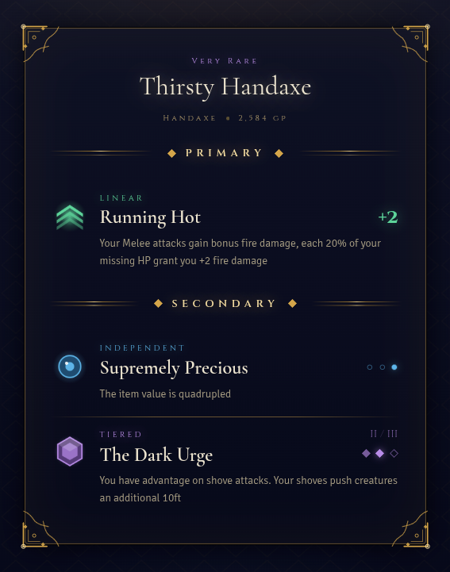
 &nbsp;&nbsp;&nbsp;&nbsp;&nbsp;&nbsp;&nbsp;
  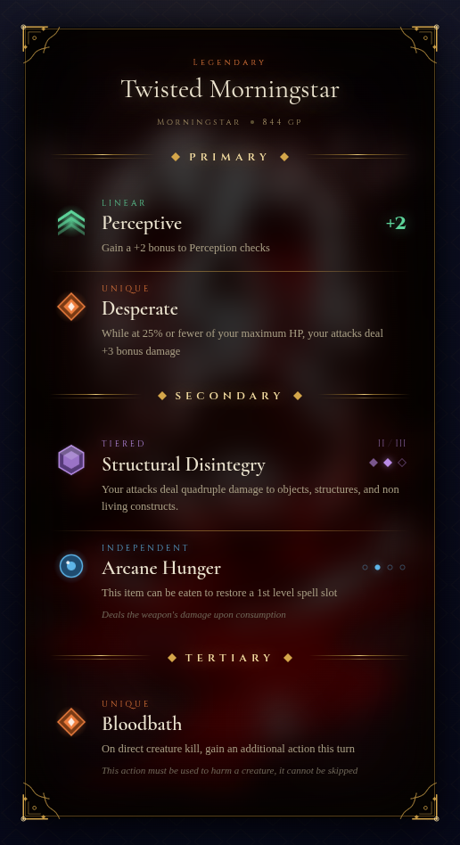

## The Loot - Modifiers with depth

Most modifiers come in multiple variations, their strength set by an internal **float** rolled from the item's rarity.

  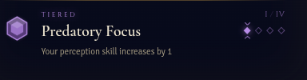

  

  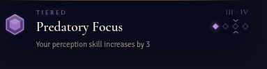

  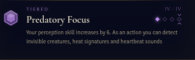

Beyond strength, there are four modifier types, each stacking differently on your character sheet across items.

 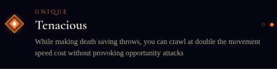

**Unique** doesn't stack. Only the strongest copy applies.

 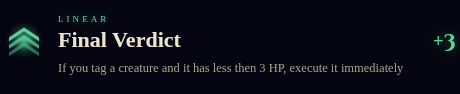

**Linear** Multiple modifiers stack linearly together. More items, bigger effect.

 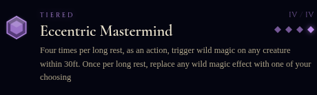

**Tiered** Accumulates across items and unlocks qualitatively new tiers: two lower tiers combine into a single stronger
one. Tier IV doesn't roll naturally, and can only be unlocked by stacking lower tiers.

 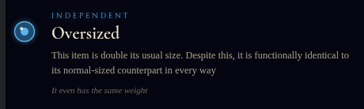

**Independent** Doesn't stack. Instead, it patches the item itself, adding properties rather than touching your character
sheet.

> Attune up to three items. Matching modifiers aggregate at the **player level** in the form of feats and active effects.
> Swap only on a short rest, no free mid-combat shuffling >:( !

## The Gacha - Gambling for everyone!

Loot is the engine. The pull is the experience.

 

A pull is shaped by a base **envelope** plus any **wishes** the player spends on top of it. Together they set the levers
that decide what gets generated, how much the player sees, and how much they keep:

| Lever              | What it does                                                           |
|--------------------|-----------------------------------------------------------------------|
| **Reveal**         | How many items are generated to choose from                           |
| **Pull**           | How many of them the player keeps                                     |
| **Rarity Luck**    | Biases the draw toward higher-rarity items (think D&D advantage)      |
| **Float Luck**     | Biases modifier strength upward                                       |
| **Equipment Pool** | Restricts draws to useful item types                                  |
| **Visibility**     | How much is shown before picking, from *blind* to full modifier reveal |

**Envelopes and wishes are single-use and earned through play, and every wish is a tradeoff.** A wish that boosts one
lever usually costs another, so there's no shortcut to overpowered gear. A great pull is something players *build
toward*, then gamble on. Pair it with an in-world economy (sell the duds, buy more envelopes) and the loot loop runs
itself.

### How a pull plays out

**1. Set the levers.** Stack wishes onto an envelope to shape the draw.

 

**2. Reveal.** The configured items are generated and shown at the chosen visibility level.

 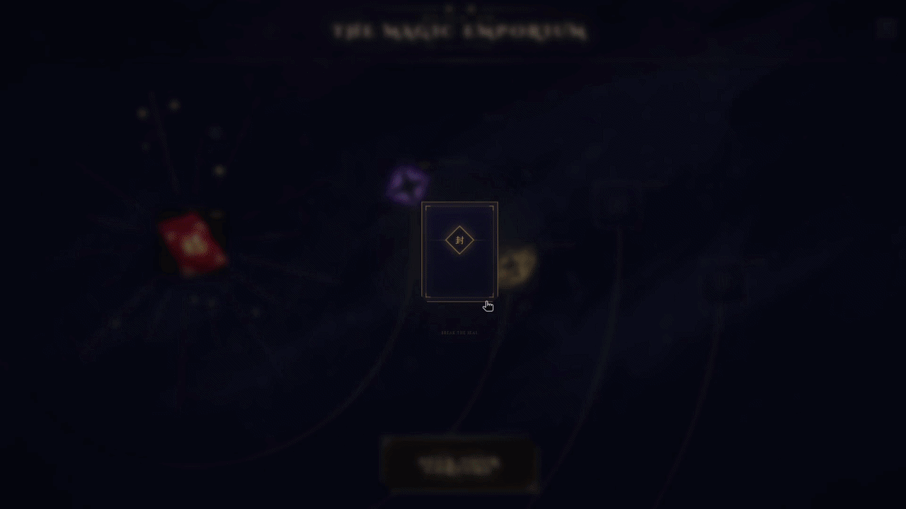

Here: 9 reveals at moderate visibility, so the player sees each item's name and type, but not its rarity or modifiers.

**3. Pick and inspect.** Keep your picks and inspect what you got, then line up the next gamble.

 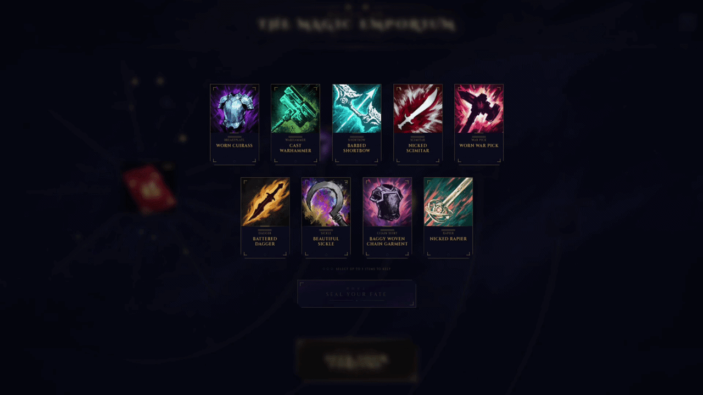

## Built for GMs

- 📦 **Content packs.** Install modifier packs to expand the pool, mix and match freely
- 🎚️ **Customization** Disable anything you don't want, nerf or buff to your heart's content
- ✍️ **Author your own.** Custom modifiers, vouchers, and wishes use the same format as the built-ins and drop straight
  into the pool
- 🛠️ **Standard Foundry items everywhere.** Items, vouchers, and wishes are normal FoundryVTT items, with their values
  stored in flags
- ⚙️ **No overload** Modifiers are designed with GM overload in mind: the taxing work falls on the player, so you can
  keep on killing them!

## Try it yourself

Seen enough? You can play with the actual interface, open pulls, inspect items, and explore modifiers. Right in your browser:

[Live Demo](https://kairosunsupervised.github.io/TheMagicEmporium/iframe.html?id=components-gacha-reveal--default&viewMode=story)

> **DEMO DISCLAIMER**
>
> - This is a [Storybook](https://storybook.js.org/) running the UI against **mocked data**, no Foundry VTT required
> - It showcases the components in isolation, without FoundryVTT or a character sheet, so character sheet depending flows and live game state won't behave like the real module
> - The Gacha story uses real modifiers from the default packs, all other component stories use fixtures with out of date modifier descriptions

## Requirements

- **Foundry VTT** v13+
- **D&D 5e** system (`dnd5e`)
